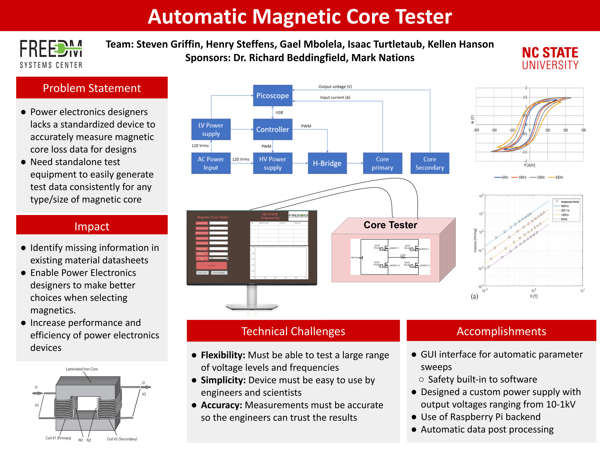

# Open-Source-Magnetic-Core-Tester

This repository contains all of the information needed to create and operate a Magnetic Core Tester

* GUI using PySimpleGUI included to specify core and test parameters
   * see ./gui for source code
* Data Acquisition code using PicoSDK and python libraries
   * see ./data_acq for source code
*
* See poster below for information on the project

